# VoiceLab — Resumen de Implementación y Arquitectura

Este documento describe la arquitectura, los cambios técnicos realizados y el estado de la integración de **VoiceLab** (laboratorio de pruebas conducido por voz con Gemini Live nativo).

---

## 1. Arquitectura de Integración

VoiceLab reutiliza la lógica de negocio, persistencia y diagnóstico del **ChatLab** de texto original, desacoplando la transmisión de audio del procesamiento pesado.

```mermaid
sequenceDiagram
    participant Browser as Frontend (VoiceLab)
    participant Backend as Backend (WS /chat/voice)
    participant Gemini as Gemini Live API (Google)
    participant REST as Backend REST (API)
    participant DB as Base de Datos (Neon/Postgres)

    Browser->>Backend: Conexión WebSocket (con ?token=)
    Note over Backend: Valida token guard & avatar
    Backend-->>Browser: Conexión aceptada
    Browser->>Backend: {"type": "init", ...}
    Backend->>Gemini: Abre sesión Live bidireccional
    Gemini-->>Backend: Conexión establecida
    
    rect rgb(20, 20, 30)
        Note over Browser, Gemini: Loop de Conversación por Voz (PCM24)
        Browser->>Backend: Stream de audio (micrófono)
        Backend->>Gemini: Envía audio PCM16
        Gemini-->>Backend: Retorna audio & captions en tiempo real
        Backend-->>Browser: Proxy de audio (PCM24) & transcripts
    end

    Note over Gemini: Detecta cierre de entrevista (closing_intent)
    Gemini->>Backend: Cierre / Fin de conversación
    Backend-->>Browser: {"type": "session_end"}
    Note over Browser: Cierra micrófono y reproduce cola de audio

    rect rgb(30, 20, 20)
        Note over Browser, REST: Análisis y Persistencia (REST)
        Browser->>REST: POST /api/chat/diagnostico (con ChatMsg[])
        REST-->>Browser: Retorna Diagnóstico Estructurado
        Browser->>REST: POST /api/chat/conversation (con satisfacción/feedback)
        REST->>DB: Guarda en chatlab_conversations
    end
```

---

## 2. Detalle de Cambios Técnicos

### Backend (`menteviva-backend/`)
- **`app/routers/conversation.py`**:
  - Se modificó `_run_gemini_conversation` para aceptar el parámetro `finalize: bool = True`. Al configurarse en `False`, omite la llamada a `_finalize_and_analyze` y el análisis automático del servidor, notificando al cliente con `{"type": "session_end"}` para que este coordine las peticiones REST.
  - Se implementó la ruta WebSocket `/api/chat/voice/{avatar_id}` protegida por un **Token Guard** que lee el query parameter `token` y lo contrasta contra `settings.chatlab_token`. Cierra la conexión con código `1008` (Policy Violation) si hay discrepancias.
  - Se agregaron pruebas de integración unitarias mediante `TestClient` para asegurar el correcto bloqueo de tokens y validación de avatares sin consumir cuota de llamadas de Gemini.

### Frontend (`menteviva-frontend/`)
- **Hook `src/hooks/useVoiceLab.ts`**:
  - Hook especializado y callback-driven.
  - Administra la captura local de micrófono a 16kHz y la reproducción de audio PCM24, reusando el reproductor y worklets preexistentes de `utils/pcm.ts`.
  - Expone funciones imperativas (`connect`, `startMic`, `stopMic`, `endSession`) y notifica eventos al componente padre por medio de callbacks (`onUserMessage`, `onAssistantMessage`, `onStatusChange`, `onClosingIntent`, `onError`, `onEnded`).
- **Módulo Compartido `src/pages/chatlab/`**:
  - Se extrajeron a archivos independientes los tipos (`types.ts`), formateadores y constantes (`helpers.ts`), exportador a markdown (`export.ts`) y los componentes visuales (`components.tsx`): `CollapsibleSection`, `Skeleton`, `DiagnosticoModal`, `SatisfactionModal` y `FeedbackModal`.
  - Esta modularización permite que tanto `ChatLab.tsx` como `VoiceLab.tsx` compartan la misma lógica de presentación y persistencia de payloads sin duplicar código.
- **Página `VoiceLab.tsx` e Integración**:
  - Diseñada imitando una interfaz de llamada (emoji animado del avatar con ondas de volumen RMS, captions flotantes en scroll, botones de mute y colgado de llamada).
  - Incluye un banner con cuenta regresiva de 5 segundos al recibir `onClosingIntent` para permitir al usuario cancelar el cierre si lo desea.
  - **Corrección de Bugs de Integración**:
    1. Se implementó el registro de errores en `session.errorLog` dentro del callback `onError` para mantener paridad en la telemetría de errores del diagnóstico.
    2. Se introdujo una referencia `endingRef` para distinguir cierres e interrupciones intencionales (desmontajes, reinicios, fin de llamada) de caídas de conexión reales, eliminando la aparición errónea del banner "Conexión perdida".
- **Ruteo (`App.tsx` y `ChatLab.tsx`)**:
  - Se dio de alta la ruta `/voice-lab` en el enrutador principal de React.
  - Se incorporaron botones para alternar bidireccionalmente entre el ChatLab de texto y el VoiceLab de voz.

---

## 3. Guía de Verificación y Handoff
La verificación y control de calidad manual del VoiceLab deben seguir la guía paso a paso detallada en [14_voicelab_qa.md](file:///C:/Users/pcdec/OneDrive/Documentos/Mente%20Viva/docs/plans/14_voicelab_qa.md).
